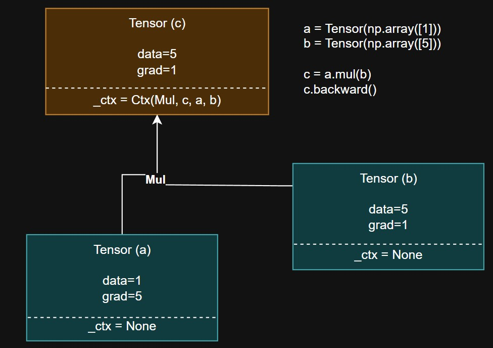

# naivegrad - Naive Implementation of Auto-Grad System
[](https://github.com/idk2k/naivegrad/actions/workflows/test.yml)

Inspired by *grad libraries and PyTorch.
## Background
Try to implement basic base-blocks of nn:
- `optimizers: Adam, SGD`
- `forward pass graph creation`
- two mode `auto-differentiation` (reverse/`backward` and `forward`)
- `gradient accumulators in ctx`
- `some basic NN utilities: layers, neurons, MLPs, backpropagation`.

## Usage
### Simple example
```python
import numpy as np
from naivegrad.core_tn import Tensor

# Creating a Tensor instances and performing some operations (OPs)
x = Tensor(np.eye(3))
y = Tensor(np.array([[1.0, 1.0, -1.0]]))
z = y.dot(x).sum()
z.backward()

# Print gradient for x and y Tensor instances in computation graph
print(f"x.grad={x.grad}=dz/dz, y.grad={y.grad}=dz/dy")
```

### MNIST example (NN with 128-length hidden layers):
```python
from naivegrad.core_tn import Tensor
import naivegrad.optimizer as optimizer
from naivegrad.utils import initialize_layer_uniform

class NaiveNet:
    def __init__(self):
        self.l1 = Tensor(initialize_layer_uniform(784, 128))
        self.l2 = Tensor(initialize_layer_uniform(128, 10))

    def forward(self, x):
        ret = x.dot(self.l1).relu().dot(self.l2).logsoftmax()
        return ret
   
model_instance = NaiveNet()
sgd_optimizer = optim.SGD([model_instance.l1, model_instance.l2], lr=0.001)

# Then with training for-loop
out = model.forward(x)
loss = out.mul(y).mean()
loss.backward()
optim.step()
```

## Architecture

Below is basic example of auto diff in reverse mode, with graph representation.\


## History

### Version 1.x.0 (e6766b3db951e0efde3bbfb2640189b66d376dc4):
- Ctx contain: OP function instance (for example ReLU), parents ( a + b = c then a,b is parents which produced c )
saved_tensors for backward pass, save_for_backward();
- Each Tensor stores context Ctx in _ctx; data and grad.
- On OP .apply() Ctx is created and then forward() called to create output Tensor, and Ctx is stored in that Tensor _ctx field.
- Each Tensor have backward() which is goes if _ctx is not None. Then it recursively apply backward() to parents.
- Also backward() passes ctx and grad of output tensor (a + b = c then c.grad  is grad of output tensor). gets output and apply it assign it to parents t.grad.




## Installation

```bash
git clone https://github.com/idk2k/naivegrad.git && cd naivegrad
pip install -r requirements.txt
py3 -m pip install -e .
```

## Todo
- numeric gradient check
- conv

## Special thanks to
    - https://sidsite.com/posts/autodiff/
    - https://github.com/pytorch/pytorch/blob/main/torch/autograd/function.py
    - https://docs.pytorch.org/docs/stable/notes/autograd.html
    - https://docs.pytorch.org/tutorials/intermediate/autograd_saved_tensors_hooks_tutorial.html
    - http://vbystricky.ru/2017/10/mnist_cnn.html