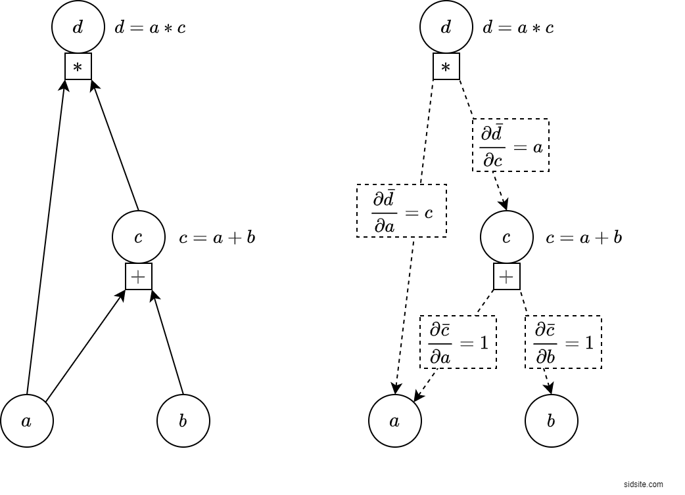

# naivegrad - Naive Implementation of Auto-Grad System

## Background
Try to implement basic base-blocks of nn: `optimizers`, `graph producers`,  two mode `auto-differentiation` (reverse/`backward` and `forward`), `grad accumulators`, `nn modules`, `layers`, `backprop`.

Below is basic example of auto diff in reverse mode, with graph representation.

## Special thanks to
    - https://sidsite.com/posts/autodiff/